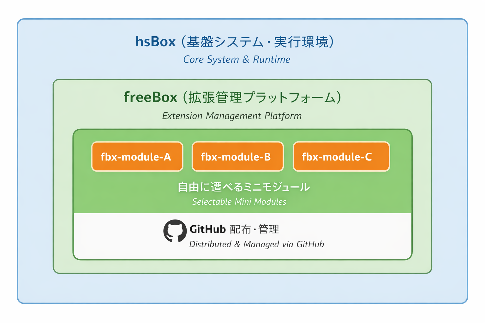

[← freeBox トップへ戻る](/freebox/)

# freeBox ネーミング検討について

このページでは、freeBox に関連する名称について、  
これまでの検討内容と現時点での扱いを共有します。

freeBox は、最初から完成形を決め切るのではなく、構想として検討を進めながら、  
v1.0.0 の実装に合わせて段階的に名称を採用してきました。  
そのため本ページは、最終決定の宣言というよりも、検討の経緯と採用状況を記録したものです。

> **v1.0.0 リリース時点での採用名称**:
> - 全体の構想 / リポジトリ名: **freeBox**
> - hsBox 上で Module を管理する実装: **freeBox Loader**
> - 機能単位: **Module**
> - Module を拡張する追加要素: **Plugin**
> - 配布パッケージ形式: **`.hbx`**
>
> これらは v1.0.0 において採用された呼称です。  
> 今後の検討・追加要素については、本ページで継続的に整理していきます。

---

## なぜネーミングを検討しているのか

freeBox は、hsBox を拡張するための仕組みとして構想しています。  
その性格上、

- 製品名ではない
- 単一の機能を指す言葉でもない
- 利用者や開発者が関わる余地を含んだ概念

である必要があります。

名前が「何を指しているのか」「どこまでを含むのか」を誤解させてしまうと、  
freeBox の考え方そのものが伝わりにくくなってしまいます。

そのため、ネーミングは後回しにせず、  
構想と並行して慎重に検討してきました。

---

## freeBox という名前について

v1.0.0 では、構想全体を指す名称として **freeBox** を採用しています。

この名前には、次のような意味合いを込めています。

- 機能や用途を限定しない「箱」であること
- 利用者が自由に選び、追加し、組み替えられる余地があること
- 完成形ではなく、拡張や実験を受け止める枠であること

一方で、「free」という言葉が持つ意味の幅や、  
誤解を生む可能性についても認識しています。  
freeBox という総称が示す範囲は、構想の発展とともに整理を続けていく予定です。

---

## 関連する名称の考え方

freeBox には、いくつかの関連要素が存在します。  
それぞれについて、v1.0.0 で採用した呼称と、引き続き検討中の項目を整理します。

## freeBox という名前が示す構造

以下は、現在検討している freeBox の構成イメージです。

この図が示すように、freeBox は hsBox 上で
Module を選択・管理するための「箱」として
位置づけています。

### パッケージ仕組みの確立

Module を配布・導入するためのパッケージ形式として、v1.0.0 では **`.hbx`** を採用しました。

- `.hbx` は ZIP ベースのアーカイブ形式
- Module 単位での配布・インストール・削除を Manager UI から扱える
- ビルド手順は `hbx_build_tool_guide.md` に整理済み

一方で、**複数の Module をまとめて扱うパッケージング**（コレクション・バンドル相当）については、  
v1.0.0 では実装していません。  
今後 freeBox の活用が広がる中で必要性と呼称の両方を検討していく予定です。

---

## なぜ全部を決めきらないのか

freeBox は、「名前を先に決めて枠にはめる」よりも、  
「どう使われ、どう関わられるか」を見ながら形にしていくことを重視しています。

そのため、

- 実装や運用が見えてから決めたい名前
- 議論を通じて自然に定着していく名称

が存在すると考えています。

v1.0.0 で採用した名称も含めて、  
利用と検証の中で必要があれば見直し・追記を行っていきます。

---

## 今後について

今後は、

- freeBox 全体の構成整理
- Module の粒度・運用ルールの具体化
- 実際の運用・検証を通じたフィードバックの反映

と並行して、名称についても検討を続けていきます。

新しい呼称の採用や、既存の呼称に大きな変化があった場合には、  
このページを更新する形で共有する予定です。
---
[← freeBox トップへ戻る](/freebox/)
